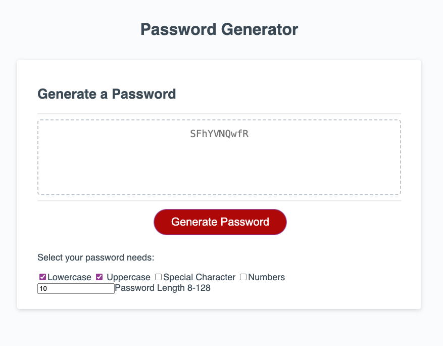

# Password_Generator

## Description

To develop a program that can create complex and secure passwords for the user. This project was built to provide users a quick way to meet various password needs across the web. With so many different requirments for passwords from length and various character needs, it can be difficult to create secure passwords, so this program aims to solve that.

Site: https://ravensandcrows.github.io/password_generator/

## Usage

To use, enter in the password length desired, and then check at least one of the character options.

When you log on to the site you will see:

If you do not select enough requirments or your password is too short or long an alert will popup:

Here is an example of a password with few elements selected:

Here is an example of a password with every element selected:

## Credits

Using Checkboxes
https://www.javascripttutorial.net/javascript-dom/javascript-checkbox/
https://www.w3schools.com/js/js_arrays.asp
https://www.w3schools.com/js/js_if_else.asp

Number input
https://www.w3schools.com/jsref/prop_number_value.asp

Placeholder:
https://www.w3schools.com/tags/att_placeholder.asp#:~:text=Definition%20and%20Usage,the%20user%20enters%20a%20value.
https://www.w3schools.com/jsref/tryit.asp?filename=tryjsref_text_placeholder
https://www.w3schools.com/jsref/prop_text_placeholder.asp

making password:

https://udn.realityripple.com/docs/Web/JavaScript/Reference/Operators/Addition_assignment#:~:text=The%20addition%20assignment%20operator%20(%20%2B%3D,Addition%20or%20concatenation%20is%20possible.

https://www.w3schools.com/jsref/jsref_tostring_array.asp#:~:text=The%20toString()%20method%20returns,not%20change%20the%20original%20array.

https://java2blog.com/remove-comma-from-string-javascript/#google_vignette

https://www.geeksforgeeks.org/how-to-select-a-random-element-from-array-in-javascript/

https://www.freecodecamp.org/news/how-to-insert-an-element-into-an-array-in-javascript/#:~:text=When%20you%20want%20to%20add,your%20array%2C%20use%20splice()%20.

https://www.freecodecamp.org/news/what-does-the-hashrocket-symbol-mean-in-javascript/#:~:text=The%20%22%3D%3E%22%20symbol%2C,syntax%20than%20traditional%20function%20expressions.

https://developer.mozilla.org/en-US/docs/Web/JavaScript/Reference/Global_Objects/Array/forEach

## License

Please refer to the LICENSE in the repo.
